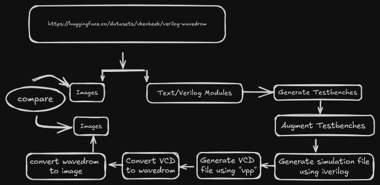

Solution
========

The solution to this problem is to fine-tune a model so that it can generate the wavedrom code for a given image of a timing diagram.
In order to do this, we need to generate a dataset of images and their corresponding wavedrom code. We can then use this dataset to fine-tune a model to generate the wavedrom code for a given image.


# Dataset Generation
==================

The dataset generation process is as follows:





1. Generate the test benches for each of the modules in the dataset.
See generate_tb.sh for more details on the variables used in this command.
```
gentbvlog -in "$FILE" -top "${MODULE}" -out "${TRAIN_DIR}/${BASENAME}_tb.v" -rst "reset" -max_sim_time 199
```

2. Augment the test benches for the VCD files. Add these lines to the test benches inside the intial/begin block. See augment_testbench.ipynb for more details.
(Currently broken so this is done manually.)
```
$dumpfile("file_name.vcd");
$dumpvars(0,testbench);
```

3. Run the simulation for each module using iverilog(see generate_vcd.ipynb ).
```
 cmd = "iverilog -o " + path + "/" + str(i+1) + " " +path + "/" + prog_name + " " + path + "/" + tb_name;
```

4. Generate the vcd file using vpp.
```
vvp train/1 && mv 1.vcd train/
```

5. Convert the vcd file to wavedrom code using the vcd2wavedrom tool.
```
python -m vcd2wavedrom.vcd2wavedrom -i train/1.vcd >> train/1.out
```

6. Generate the image of the timing diagram using the wavedrom code either using the wavedrom online tool or the wavedrom-cli tool.
```
wavedrom-cli -i train/1.out -s 1 -o train/1.png
```